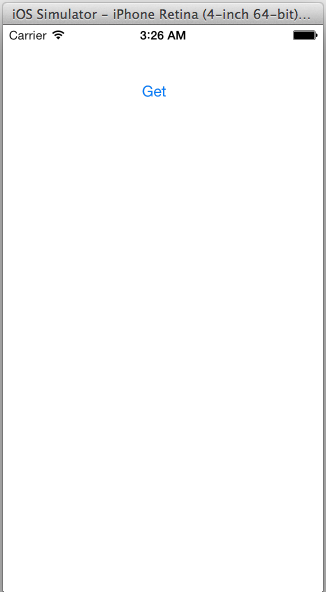
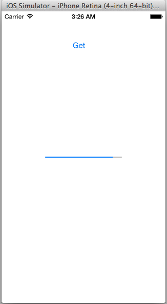
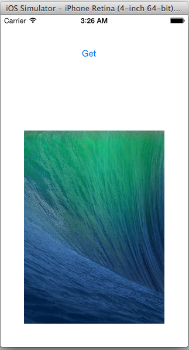

# iOS7-NSURLSession-Node.js-Server

Node.js server for iOS7 NSURLSession example.

You can see the simple image.

The iOS code is also on [GitHub](https://github.com/man27382210/iOS7-NSURLSession),
And you can see on [Web](http://aqueous-beyond-6099.herokuapp.com).

